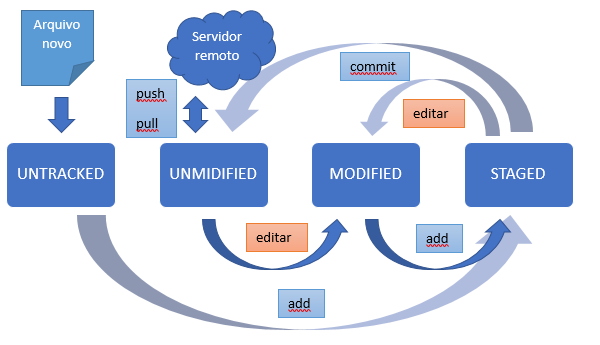

# GIT
## Configurações inciais
```
git config --global user.name "<nome do usuário>"
```
Para configurar o nome do usuário
```
git config --global user.email "<email do usuário>"
```
Para configurar o e-mail do usuário
```
git config --global core.editor <editor>
```
Configurar editor padrão
## Inicializar repositório
```
git init
```
Inicializa repositório
## Ciclo de vida e estados dos arquivos
```
git add
```
Move os arquivos do `UNTRACKED` ou `MODIFIED` para o `STAGED`
```
git commit -m "<Mensagem do commit>"
```
Commitar arquivos

## Visualizar
```
git status
```
Visualizar estado dos arquivos
```
git log
```
Mostra os dados dos commits
```
git log --graph
```
Mostra o historico dos commits em forma de arvore
```
git diff
```
Mostra as mudanças nos arquivos
## Desfazer as coisa
```
git restore --staged "<nome do arquivo>"
```
ou
```
git reset HEAD "<nome do arquivo>"
```
Remove arquivo do `STAGED` para o `MODIFIED`
```
git checkout "<nome do arquivo>"
```
Descarta versão no `MODIFIED` para a última no `STAGED` ou no `UNMODIFIED`  
## Desfazer commit
```
git reset --soft <hash do commite>
```
Retorna para o commit mantendo alterações no `STAGED`
```
git reset --mixed
```
Retorna para o commit mantendo alterações no `MODIFIED`
```
git reset --hard
```
Retorna para o commit descartando as modificações
## Branche
```
git branch
```
Lista os branchs
```
git checkout -b <nome do novo branch> 
```
Cria um novo branch
```
git checkout <nome do branch> 
```
Muda para o branch selecionado 
```
git branch -D <nome do branch>
```
Exclui branch
## Merge e Rebase
### Merge
```
git merg <nome do branch>
```
Mescla branch atual com branch selecionado
```
master:    (C1)___(C2)______(C4)___(C5)___...
                    \               /
branch2:             \_(C3)________/
```
### Rebase
```
git rebase <nome do branch>
```
Faz rebase do branch selecionado para o branch atual
```
master:    (C1)___(C2)______(C4)___(C3')___...
                    \
branch2:             \_(C3)
```
## Repositório remoto
```
git remote add origin <url do repositório remoto>
```
Adiciona um repositório remoto
obs: O nome `origin` é convencionado para o repositório remoto principal
```
git remote
```
Lista os repositórios remotos
```
git remote -v
```
Para exibir mais detalhes
```
git push <repositório remoto> <branche>
```
Envia commites para o repositório remoto
```
git clone <url do repositório remoto>
```
Baixa arquivos do repositório remoto